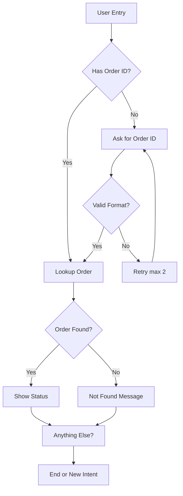

# Conversation Flow Design

**Input**: $ARGUMENTS

---

## Your Mission

Design clear, efficient conversation flows that guide users to their goals while handling edge cases gracefully.

**Golden Rule**: Every conversation should feel natural, reach resolution quickly, and know when to involve a human.

---

## Phase 1: PARSE INPUT

### Input Options

| Input | Action |
|-------|--------|
| `--design "flow-name"` | Design new conversation flow |
| `--analyze` | Analyze existing flow for issues |
| `--visualize` | Generate flow diagram |
| `--optimize` | Find bottlenecks and drop-offs |
| `--handoff` | Design human handoff flow |
| No flags | Interactive flow design session |

---

## Phase 2: FLOW DESIGN FUNDAMENTALS

### 2.1 Conversation Flow Components

```markdown
## Flow Building Blocks

### Entry Points
- User initiates (greeting, direct question)
- Proactive trigger (time-based, event-based)
- Handoff from another system

### Dialog Turns
- Bot asks question
- User responds
- Bot processes & responds

### Decision Points
- Intent classification
- Entity validation
- Condition checks

### Actions
- API calls
- Database lookups
- External system updates

### Exits
- Successful resolution
- Human handoff
- User abandonment
- Error/fallback
```

### 2.2 Flow Types

```markdown
## Common Flow Types

### Linear Flow
Simple, step-by-step process
```
Start → Step 1 → Step 2 → Step 3 → End
```
Use for: Onboarding, simple inquiries

### Branching Flow
Multiple paths based on user input
```
Start → Question → [Option A] → Path A
                 → [Option B] → Path B
                 → [Option C] → Path C
```
Use for: Product selection, troubleshooting

### Looping Flow
Repeat until condition met
```
Start → Collect Info → Validate → [Invalid] → Ask Again ↩
                                → [Valid] → Continue
```
Use for: Data collection, authentication

### Contextual Flow
Different paths based on context
```
[New User] → Onboarding Flow
[Returning] → Quick Service Flow
[VIP] → Priority Flow
```
Use for: Personalized experiences
```

---

## Phase 3: FLOW DESIGN TEMPLATES

### 3.1 Order Status Flow

```markdown
## Flow: Order Status Check

### Overview
- **Goal**: Help user check order status
- **Avg Turns**: 3-5
- **Success Rate Target**: 95%

### Flow Diagram

```
┌─────────────────────────────────────────────────────────────┐
│                     ORDER STATUS FLOW                        │
└─────────────────────────────────────────────────────────────┘

[User]: "Where's my order?"
         │
         ▼
┌─────────────────────┐
│ Has Order ID?       │
└─────────────────────┘
    │           │
   Yes          No
    │           │
    ▼           ▼
┌─────────┐  ┌─────────────────┐
│ Lookup  │  │ "Can you share  │
│ Order   │  │  order number?" │
└─────────┘  └─────────────────┘
    │                  │
    ▼                  ▼
┌─────────────┐  [User provides ID]
│ Order Found?│         │
└─────────────┘         │
    │       │           │
   Yes      No          ▼
    │       │     ┌───────────┐
    ▼       ▼     │ Validate  │
┌───────┐ ┌─────────────┐    │ Format    │
│Show   │ │"I couldn't  │    └───────────┘
│Status │ │ find that   │         │
└───────┘ │ order"      │    Valid / Invalid
    │     └─────────────┘         │
    │           │                 ▼
    ▼           ▼           ┌─────────┐
┌───────────────────────────┤ Retry   │
│ "Anything else I can help?"│ (max 2) │
└───────────────────────────┘└─────────┘
    │                              │
    ▼                              ▼
[New Intent] or [End]        [Handoff to Human]
```

### Turn-by-Turn Script

**Turn 1 - User Entry**
User: "Where's my order?" / "Track my package" / "Order status"
Intent: `order.status`

**Turn 2 - Collect Order ID (if missing)**
Bot: "I'd be happy to help track your order! Could you share your order number? It starts with ORD- or you can find it in your confirmation email."

User: "ORD-12345" / "It's 12345" / "I don't have it"

**Turn 3a - Order ID Provided**
[API Call: getOrderStatus(order_id)]

If found:
Bot: "Great news! Order ORD-12345 is currently [status].
- Shipped on: [date]
- Expected delivery: [date]
- Tracking: [link]

Is there anything else I can help with?"

If not found:
Bot: "I couldn't find an order with that number. Could you double-check? Or I can look it up with your email address."

**Turn 3b - No Order ID**
Bot: "No problem! I can look it up with your email address. What email did you use for the order?"

### Edge Cases

| Scenario | Response |
|----------|----------|
| Multiple orders | "I found [N] orders. Which one: [list]" |
| Order not shipped | "Order placed on [date]. Preparing..." |
| Order delivered | "Marked as delivered on [date]. Issues?" |
| Very old order | "That order is from [date]. Need help?" |

### Success Metrics
- Resolution rate: 95%
- Avg turns to resolution: 3
- Handoff rate: <5%
- CSAT: 4.5+
```

### 3.2 Return/Refund Flow

```markdown
## Flow: Return Request

### Overview
- **Goal**: Initiate product return
- **Avg Turns**: 5-7
- **Handoff Triggers**: High-value, exceptions

### Flow Diagram

```
[User]: "I want to return this"
         │
         ▼
┌─────────────────────┐
│ Get Order/Product   │
└─────────────────────┘
         │
         ▼
┌─────────────────────┐
│ Check Return Window │
└─────────────────────┘
    │           │
  Within      Outside
    │           │
    ▼           ▼
┌─────────┐  ┌─────────────┐
│ Ask     │  │ Explain     │
│ Reason  │  │ Policy      │
└─────────┘  │ + Escalate  │
    │        └─────────────┘
    ▼
┌─────────────────────┐
│ Generate Return     │
│ Label               │
└─────────────────────┘
         │
         ▼
┌─────────────────────┐
│ Confirm & Send      │
│ Instructions        │
└─────────────────────┘
```

### Turn-by-Turn Script

**Turn 1 - User Request**
User: "I want to return my order"
Intent: `return.initiate`

**Turn 2 - Identify Order**
Bot: "I can help with that! Which order would you like to return?"
[Show recent orders or ask for order ID]

**Turn 3 - Identify Item**
Bot: "Which item from order ORD-12345 would you like to return?"
[Show items in order]

**Turn 4 - Check Eligibility**
[Check return window, item condition requirements]

If eligible:
Bot: "This item is eligible for return. May I ask what's the reason? This helps us improve."
- Didn't fit/like
- Damaged/defective
- Wrong item received
- Other

If not eligible:
Bot: "I'm sorry, this item is outside our 30-day return window. Let me connect you with a specialist who might be able to help."
[Handoff to human]

**Turn 5 - Generate Return**
Bot: "I've created your return. Here's what to do next:
1. Print the label I'm sending to your email
2. Pack the item in original packaging
3. Drop off at any [carrier] location

Refund will process within 5-7 days of receiving the item.

Any questions about the return process?"

### Escalation Triggers
- High-value order (>$500)
- Multiple returns from same customer
- Item damaged on arrival
- Return window exception request
- Refund vs exchange preference
```

### 3.3 Troubleshooting Flow

```markdown
## Flow: Technical Troubleshooting

### Overview
- **Goal**: Resolve technical issue
- **Avg Turns**: 4-8
- **Handoff Triggers**: Unresolved after 3 attempts

### Flow Diagram

```
[User]: "It's not working"
         │
         ▼
┌─────────────────────┐
│ Identify Product    │
└─────────────────────┘
         │
         ▼
┌─────────────────────┐
│ Identify Issue      │
│ Category            │
└─────────────────────┘
         │
         ▼
┌─────────────────────┐
│ Guided              │
│ Troubleshooting     │◄────┐
└─────────────────────┘     │
    │           │           │
  Fixed     Not Fixed      │
    │           │           │
    ▼           ▼           │
┌───────┐  ┌─────────┐      │
│Confirm│  │Next Step│──────┘
│Resolve│  │(max 3)  │
└───────┘  └─────────┘
    │           │
    │      Exhausted
    │           │
    ▼           ▼
 [End]    [Human Handoff]
```

### Decision Tree

```yaml
Issue: Connectivity
├── Not connecting at all
│   ├── Try: Power cycle device
│   ├── Try: Check cables/wifi
│   └── Try: Reset to factory
├── Intermittent connection
│   ├── Try: Move closer to router
│   ├── Try: Check for interference
│   └── Try: Update firmware
└── Slow connection
    ├── Try: Speed test
    ├── Try: Reduce connected devices
    └── Try: Contact ISP

Issue: Audio/Voice
├── No sound
│   ├── Try: Check mute settings
│   ├── Try: Check volume
│   └── Try: Check audio output
├── Distorted sound
│   ├── Try: Reduce volume
│   ├── Try: Check connections
│   └── Try: Test different source
└── Echo/feedback
    ├── Try: Reduce speaker volume
    ├── Try: Move devices apart
    └── Try: Use headphones
```
```

### 3.4 Appointment Booking Flow

```markdown
## Flow: Appointment Booking

### Flow Diagram

```
[User]: "I need to schedule an appointment"
         │
         ▼
┌─────────────────────┐
│ What type of        │
│ appointment?        │
└─────────────────────┘
         │
         ▼
┌─────────────────────┐
│ With whom?          │
│ (if applicable)     │
└─────────────────────┘
         │
         ▼
┌─────────────────────┐
│ Show Available      │
│ Times               │
└─────────────────────┘
         │
         ▼
┌─────────────────────┐
│ Confirm Details     │
└─────────────────────┘
         │
         ▼
┌─────────────────────┐
│ Send Confirmation   │
│ + Reminders         │
└─────────────────────┘
```

### Turn-by-Turn Script

**Turn 1 - Entry**
User: "I need to book an appointment"

**Turn 2 - Type**
Bot: "I'd be happy to help schedule an appointment. What type of appointment do you need?"
- Consultation
- Follow-up
- Service/Repair
- Other

**Turn 3 - Provider (if applicable)**
Bot: "Do you have a preferred [provider/specialist]?"
- Show list
- "No preference"

**Turn 4 - Date/Time**
Bot: "Here are the available times:

**This Week:**
📅 Monday, Jan 15: 9am, 2pm, 4pm
📅 Tuesday, Jan 16: 10am, 3pm
📅 Wednesday, Jan 17: 9am, 11am, 2pm

Which works best for you?"

**Turn 5 - Confirm**
Bot: "Perfect! I've scheduled:

📅 **Tuesday, January 16 at 3:00 PM**
👤 With: Dr. Smith
📍 Location: Main Office, Room 204

I'll send a confirmation to [email] and a reminder 24 hours before.

Would you like to add this to your calendar?"

[Send calendar invite + confirmation email]
```

---

## Phase 4: HANDOFF DESIGN

### 4.1 Handoff Triggers

```markdown
## When to Handoff to Human

### Automatic Triggers
| Trigger | Priority | Reason |
|---------|----------|--------|
| User requests human | High | Explicit request |
| 3+ failed attempts | High | AI can't resolve |
| Sentiment negative | Medium | Angry customer |
| High-value customer | Medium | VIP treatment |
| Complex issue detected | Medium | Beyond AI capability |
| Legal/compliance topic | High | Risk mitigation |

### Sentiment Indicators
- Explicit: "agent", "human", "real person", "supervisor"
- Frustration: "this is useless", "doesn't work", "already tried"
- Anger: profanity, caps, "!!!", threats

### Complexity Indicators
- Multiple issues in one request
- Conflicting information
- Requires judgment/exception
- System limitations
```

### 4.2 Handoff Flow

```markdown
## Handoff Flow

```
┌─────────────────────────────────────────────────────────────┐
│                    HANDOFF FLOW                              │
└─────────────────────────────────────────────────────────────┘

[Trigger Detected]
         │
         ▼
┌─────────────────────┐
│ "I'll connect you   │
│  with a specialist" │
└─────────────────────┘
         │
         ▼
┌─────────────────────┐
│ Check Agent         │
│ Availability        │
└─────────────────────┘
    │           │
 Available   Unavailable
    │           │
    ▼           ▼
┌─────────┐  ┌─────────────────┐
│Transfer │  │ Collect Contact │
│Now      │  │ + Callback      │
└─────────┘  └─────────────────┘
    │               │
    ▼               ▼
┌─────────────────────────────────┐
│ Pass Context to Agent:          │
│ - Customer info                 │
│ - Conversation history          │
│ - Issue summary                 │
│ - Attempted solutions           │
│ - Sentiment score               │
└─────────────────────────────────┘
```

### Handoff Message Templates

**Warm Transfer (Agent Available)**:
"I'm connecting you with [Agent Name] who can better assist with this. They'll have our full conversation history. One moment please..."

**Queue (Wait Time)**:
"I'm connecting you with a specialist. Current wait time is approximately [X] minutes. While you wait, is there anything else I can help with?"

**Callback (Unavailable)**:
"Our specialists are currently helping other customers. Would you like us to call you back? We can reach out within [timeframe]."

**After Hours**:
"Our support team is available [hours]. Would you like to:
1. Leave a message for callback tomorrow
2. Schedule a callback at a specific time
3. Continue with me for other questions"
```

---

## Phase 5: FLOW OPTIMIZATION

### 5.1 Metrics to Track

```markdown
## Flow Performance Metrics

### Efficiency
| Metric | Target | Calculate |
|--------|--------|-----------|
| Avg turns to resolution | <5 | Total turns / conversations |
| Time to resolution | <3 min | End time - start time |
| Straight-through rate | >70% | No loops / total |

### Effectiveness
| Metric | Target | Calculate |
|--------|--------|-----------|
| Resolution rate | >85% | Resolved / total |
| Handoff rate | <15% | Handoffs / total |
| Repeat contact rate | <10% | Same user in 24h |

### Experience
| Metric | Target | Calculate |
|--------|--------|-----------|
| CSAT score | >4.5 | Survey average |
| Drop-off rate | <20% | Abandoned / started |
| NPS | >50 | Promoters - Detractors |
```

### 5.2 Optimization Opportunities

```markdown
## Common Flow Issues

### Too Many Steps
**Symptom**: High drop-off, long resolution time
**Fix**: Combine steps, reduce questions, use defaults

### Unclear Options
**Symptom**: Wrong path selection, confusion
**Fix**: Clearer wording, fewer options, examples

### Dead Ends
**Symptom**: No path forward, frustrated users
**Fix**: Always provide next step or escalation

### Missing Context
**Symptom**: User repeats information
**Fix**: Pass context between turns and handoffs

### Premature Handoff
**Symptom**: High handoff rate, low AI resolution
**Fix**: More training, better fallbacks, more paths
```

---

## Phase 6: OUTPUT

### 6.1 Flow Documentation

**Path**: `.prp-output/flows/flow-{name}-{date}.md`

### 6.2 Flow Diagram (Mermaid)

```markdown
## Visual Flow


```

### 6.3 Summary Output

```markdown
## Flow Design Complete

**Flow**: {flow_name}
**Created**: {timestamp}

### Flow Summary

| Metric | Value |
|--------|-------|
| Entry Points | {N} |
| Decision Points | {N} |
| Avg Path Length | {N} turns |
| Handoff Points | {N} |

### Artifacts

📊 **Flow Diagram**: `.prp-output/flows/flow-{name}-diagram.md`
📋 **Documentation**: `.prp-output/flows/flow-{name}-{date}.md`
🧪 **Test Scenarios**: `.prp-output/flows/flow-{name}-tests.md`

### Next Steps

1. Review flow with stakeholders
2. Implement in conversation platform
3. Test all paths
4. Monitor metrics and iterate
```

---

## Success Criteria

- **FLOW_DESIGNED**: All paths documented
- **EDGE_CASES_HANDLED**: No dead ends
- **HANDOFFS_DEFINED**: Clear escalation triggers
- **DIAGRAM_CREATED**: Visual representation ready
- **METRICS_DEFINED**: Success criteria established
- **TESTS_CREATED**: Scenarios for validation
